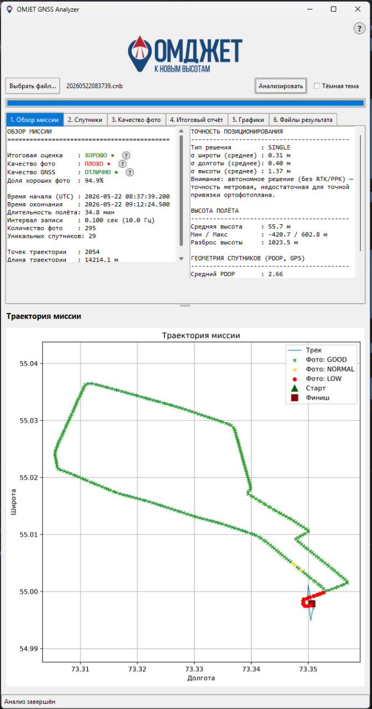

# OMJET GNSS Analyzer

**Версия:** 0.1
**Автор:** [andrewkena](https://github.com/andrewkena)


Программа для анализа «сырых» бинарных данных ГНСС-приёмника (файлы `.cnb`,
формат ComNav/SinoGNSS, OEM-совместимый протокол) с аэрофотосъёмочной миссии
беспилотника. Оценивает качество съёмки с точки зрения последующего
построения ортофотоплана: спутники, точность позиционирования, траекторию,
высоту полёта и интервалы фотосъёмки.





---

## Содержание

1. [Возможности](#возможности)
2. [Установка](#установка)
3. [Запуск](#запуск)
4. [Описание вкладок программы](#описание-вкладок-программы)
5. [Сохраняемые файлы](#сохраняемые-файлы)
6. [Сборка .exe](#сборка-exe)
7. [Ограничения](#ограничения)
8. [Структура проекта](#структура-проекта)

---

## Возможности

### 1. Декодирование CNB

- Собственный декодер на чистом Python извлекает из бинарного потока:
  - измерения GPS (псевдодальности, фаза, доплер, C/N0 — лог `RANGECMPB`);
  - эфемериды GPS (`RAWEPHEM`, полный битовый разбор подкадров по
    ICD-GPS-200);
  - готовое позиционное решение приёмника (`BESTPOS`) — для построения
    траектории;
  - временные метки фотоснимков.
- Декодер покрывает **только GPS**. ГЛОНАСС/Galileo/BeiDou/QZSS читаются из
  уже сконвертированного файла `.obs`/`.nav` (внешним инструментом
  производителя), так как эфемериды этих созвездий у ComNav используют
  недокументированные идентификаторы логов.
- Все числовые значения декодера (псевдодальность, фаза, доплер, C/N0,
  параметры орбиты) проверены побайтово против эталонного RINEX OBS/NAV,
  сформированного штатным конвертером производителя.

### 2. Анализ спутников

- Среднее/минимальное/максимальное число видимых спутников по эпохам, в т.ч.
  по каждой группировке (GPS/GLONASS/Galileo/BeiDou/QZSS/SBAS).
- Принимаемые частоты (коды сигналов) по каждой группировке — из заголовка
  RINEX OBS.
- Самая и наименее используемая группировка спутников.
- PDOP (геометрический фактор ухудшения точности) по эпохам — рассчитывается
  из положений GPS-спутников (по эфемеридам, орбита по ICD-GPS-200) и
  траектории приёмника.

### 3. Анализ фотосъёмки

- Интервалы между снимками, разрывы, номинальная частота съёмки.
- Сопоставление каждого фото с числом видимых спутников на момент съёмки и
  присвоение оценки качества (GOOD/NORMAL/LOW).

### 4. Траектория и позиционирование

- Трек миссии (широта/долгота) с метками фото, окрашенными по качеству
  съёмки (зелёный/жёлтый/красный).
- Профиль высоты полёта (MSL) по времени.
- Точность позиционирования: тип решения (SINGLE/RTK/...) и среднеквадратичные
  отклонения широты/долготы/высоты — критично для оценки абсолютной точности
  привязки ортофотоплана.

### 5. Итоговая оценка миссии

- Комбинированная оценка (ОТЛИЧНО/ХОРОШО/НОРМАЛЬНО/ПЛОХО) на основе качества
  фотосъёмки, качества GNSS-сигнала и доли «хороших» фотографий. Каждая
  оценка сопровождается кружком-подсказкой с описанием критериев.

---

## Установка

Требуется Python 3.12+.

```bash
git clone https://github.com/andrewkena/OMJETGNSSAnalyzer.git
cd OMJETGNSSAnalyzer
python -m venv .venv
.venv\Scripts\activate      # Windows
pip install -r requirements.txt
```

Либо просто скачайте готовый `OMJET_GNSS_Analyzer.exe` из релиза — Python и
зависимости не требуются.

## Запуск

**Графический интерфейс:**

```bash
python gui.py
```

или запустите `OMJET_GNSS_Analyzer.exe`.

В окне: кнопка «Выбрать файл...» → выберите `.cnb` → «Анализировать».

**Из командной строки** (без GUI, результат печатается в консоль):

```bash
python main.py
```
(путь к `.cnb`-файлу указывается в `main.py` константой `CNB_FILE`).

## Описание вкладок программы

| Вкладка | Содержание |
|---|---|
| 1. Обзор миссии | Итоговые оценки, время/длительность полёта, интервал записи, точность позиционирования, высота, PDOP |
| 2. Спутники | Статистика по спутникам, частоты по группировкам, PDOP |
| 3. Качество фото | Интервалы съёмки, разрывы, итоговое качество |
| 4. Итоговый отчёт | Сводный отчёт по миссии |
| 5. Графики | Спутники по времени, интервалы фото, гистограмма интервалов, профиль высоты, PDOP по времени |
| 6. Файлы результата | Ссылки на сохранённые CSV/TXT/PDF-отчёты, кнопки «Просмотр» и «Открыть папку с файлами» |

Карта траектории миссии всегда видна в нижней части окна независимо от
выбранной вкладки. Доступен переключатель тёмной темы.

## Сохраняемые файлы

Сохраняются в подпапках `decoded/`, `plots/`, `reports/` рядом с исходным
`.cnb`-файлом:

- `photo_satellite_report.csv` — таблица фото/спутники/качество;
- `mission_report.txt` / `mission_report.pdf` — итоговый отчёт с графиками;
- `satellites.png`, `photo_intervals.png`, `photo_histogram.png`,
  `trajectory.png`, `altitude_profile.png`, `pdop.png` — графики.

## Сборка .exe

```bash
pip install pyinstaller
pyinstaller --noconfirm --onefile --windowed --name "OMJET_GNSS_Analyzer" --icon "assets/OMJ_pin.ico" --add-data "assets;assets" gui.py
```

Готовый файл появится в `dist/OMJET_GNSS_Analyzer.exe`.

## Ограничения

- Расчёт PDOP и собственный декодер OBS/NAV используют только GPS.
- Позиционирование (`BESTPOS`) — решение самого приёмника (обычно
  одноточечное, без RTK/PPK); программа не выполняет собственных вычислений
  координат.
- Просмотр PDF-отчёта открывается во внешней программе по умолчанию.

## Android-версия (прототип)

В папке [`android/`](android/) — нативный Android-проект (Kotlin + встроенный
Python через Chaquopy), переиспользующий декодер `core/novatel/` и анализ
миссии. Графики/PDF в мобильной версии пока не реализованы. Подробности и
инструкция по сборке — в [`android/README.md`](android/README.md).

## Структура проекта

```
core/
  novatel/            # декодер бинарного протокола ComNav/SinoGNSS (GPS)
  pipeline.py          # общий конвейер анализа (используется CLI и GUI)
  rinex_*_reader.py     # чтение готовых RINEX OBS/NAV
  *_analysis.py         # анализ спутников/времени/качества фото
  pdop.py               # расчёт PDOP по эфемеридам и траектории
  *_report.py           # формирование текстового/PDF отчёта
plots/                  # графики (matplotlib)
assets/                 # логотип и иконка приложения
gui.py                  # графический интерфейс (Tkinter)
main.py                 # запуск из командной строки
```
